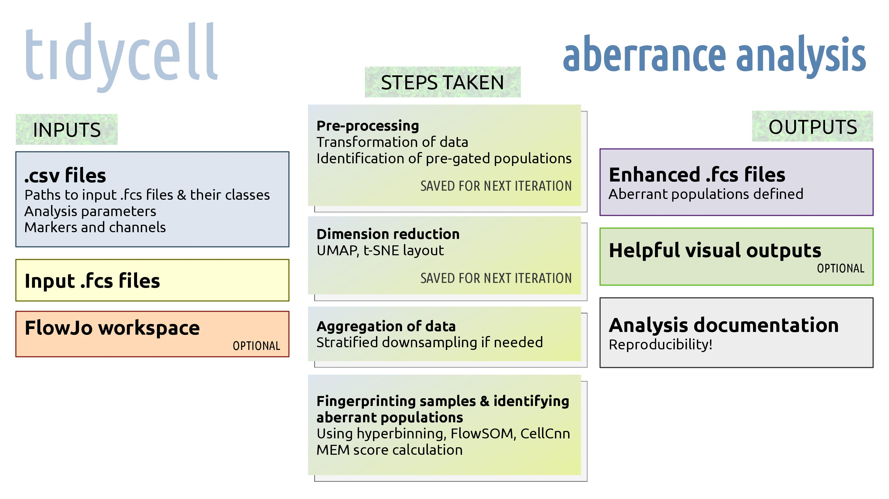
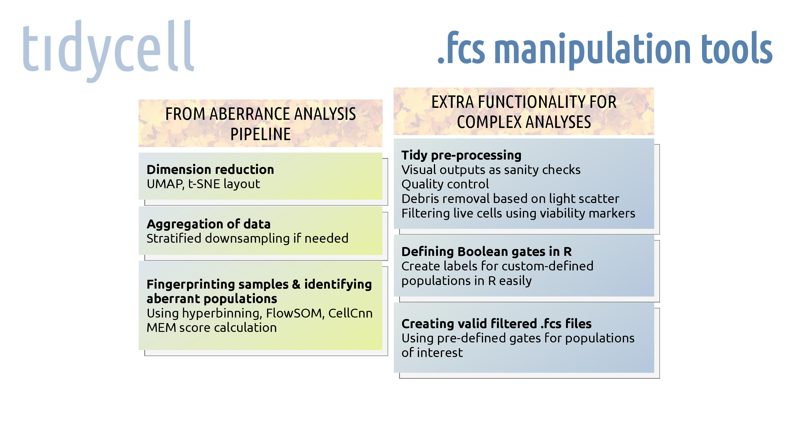

# aberrance analysis tool for cytometry

*0.1.0*

This is an early development version.

### What it is

The point of *tidycell* is to provide a simple framework for discovery of aberrant cell populations in cytometry data.

**Provided a set of .fcs files with class labels 0 and 1, *tidycell* uses multiple methods (hyperbinning, FlowSOM and CellCnn) to create fingerprints for each file and identify aberrant cell populations between the classes.** These classes typically refer to 'healthy control' and 'patient'.

The main outputs of these analyses are **enhanced .fcs files**. These contain additional columns ('channels') which can be used for gating cell populations that are enriched in either of the sample classes, and potetially responsible for disease phenotype. Other outputs include graphical outputs dubbed 'sanity checks', which can be referred to prior to analysing the enhanced .fcs files in FlowJo or other gating software. They can also serve as materials for use in presenting your analyses to other researchers. The outputs of each analysis contain information about *how* the analysis was conducted, so that your workflow is straightforward and reproducible.

Crucially, this software is (being) designed to be modular and easy to extend. *tidycell* is under construction and currently comes with no guarantees. We are testing it at CLIP (Childhood Leukaemia Investigation Prague).

## How to install it

This development version of *tidycell* runs on any Unix machine with Docker installed. Docker is a virtualisation tool which lets you run tasks in separate containers.

Once installed, *tidycell* lives in a Docker container accessible via an RStudio user interface in your web browser. The framework is written in R and also runs some Python scripts.

First, build the Docker image or download a pre-built image. If you wish to build the image yourself, navigate to `./install` and run the command `docker build -t tidycell .`. Otherwise, download the pre-built compressed image here: https://owncloud.cesnet.cz/index.php/s/am0a7rL1R1Ko0tL and use `docker load`.

Once you have the Docker image ready, run the script `docker_run.sh` with the following arguments:

* (1) port number,

* (2) name of container,

* (3) absolute path to your **inputs directory** (you will put all your analysis inputs here),

* (4) password for your container,

* (5) number of CPUs to use.

Connect to the port in your browser (`localhost:PORTNUMBER` if running locally, or use IP address of the machine instead of `localhost` if running remotely on a network) and log into the RStudio client using username `rstudio` and the password you set before.

## How to use it

Prepare a single folder of .fcs files and put them into your **inputs directory**. If you want to limit the analysis to a single gate in a gating hierarchy (or a selection of gates), create a single FlowJo workspace file (.wsp) for all the .fcs files and put it in this directory.

Include the following 3 .csv files (examples are included in `./sample_inputs`) in your **inputs directory** to configure inputs to the analysis. **analysis_settings.csv** specifies the following:

* path to a folder with .fcs files,

* path to FlowJo workspace (if any),

* gated population(s) to be used exclusively (if any),

* transformation of data (this can be ``asinh`` for hyperbolic arcsine or ``estimateLogicle`` for an adaptive logicle transformation, as implemented in the *flowCore* library),

* cofactor to use for asinh transformation if relevant (use around 0.01 for flow and 0.2 for mass cytometry data with ``asinh``),

* list of binning methods and number of bins. Available options are:

   * ``hyperbinning``, which needs number of bins that is a power of 2 (i.e. 32, 512), written as eg. ``hyperbinning=32``,

   * ``flowsom``, for which the number of bins is the number of metaclusters, written as eg. ``flowsom=32``,

   * ``cellcnn``, for which number of bins is not specified,

* name of output directory for results of the analysis (careful, data might be overwritten if it already exists),

* indication whether a concatenated .fcs file should be produced alongside the single enhanced .fcs files (1 ~ true, 0 ~ false),

* list of dimensionality reduction techniques to be applied to the data (none, ``umap``, ``tsne``, ``embedsom``, ``embedsom:tsne``, ``embedsom:umap``),

* indication whether the graphical 'sanity checks' ought to be produced alongside enhanced .fcs files.

**analysis_markers.csv** specifies names of channels and corresponding markers in the panel which are of interest either for the analysis itself or for any of the dimension reduction methods. If you want to extract marker and channel names from your .fcs files, call function `extract_markers_input` through the RStudio Console.

**analysis_inputs.csv** specifies .fcs files to be used for the analysis and their class labels. Multiple iterations of the analysis can be run, whereby the distribution into classes 0 and 1 can vary. For this, multiple columns starting with the substring 'class' can be used. To leave a file out of some iteration of the analysis, enter the string 'NA' into the corresponding cell. (Crucially, the dimension reduction layout is computed on all the files, even if they are left out of the statistical analyses. It is only computed once in the first iteration of the analysis, or not at all if it was computed before--then the .RDS file produced in some previous analysis can be specified in **analysis_settings.csv** column ``precomputed_dimension_reduction``.)

Furthermore, additional columns can be specified, which are attached to the enhanced .fcs files and which contain a numerical value or string used to identify samples (for example, 'Material' or 'Date'). Each unique value for each additional column gets a numeric flag which allows the user to use it in gating analysis in FlowJo later. A legend matching each value to its flag is produced and included in the analysis outputs.

To run the analysis, open up the port to your *tidycell* RStudio container, switch to the Terminal (not Console!), navigate to `home/rstudio/tidycell` and execute the command `./run_aberrance_analysis.sh`.

## How *tidycell* computes aberrance

When using hyperbinning or FlowSOM, a downsampled concatenated expression matrix is created (balanced, i.e. class 0 and class 1 are represented equally). A binning/metaclustering model is built on these data. Then, events in each .fcs file are classified using this model. The median abundance of cells in each bin/metacluster in class 0 (healthy donors) is computed. This is called a **baseline** and the relative representation of each cell bin/metacluster in each sample is called a **sample fingerprint**. The difference of each sample's fingerprint versus the baseline is called **aberrance**. If, for instance, we have an 8-bin model and 10 .fcs files in total, we get 80 different aberrance values: 10 for each bin. We then determine, for each file, which bins/metaclusters are underrepresented and which are overrepresented (versus the healthy baseline). (A scaled measure of over-representation and under-representation is added to the enhanced .fcs files.) We produce a series of boxplots showing aberrances of class 0 and class 1 data. We use Wilcoxon test (alpha = 0.1) to determine which bins/metaclusters are significantly aberrant with regard to their differential representation in the patients.

When using CellCnn, a convolutional neural network is built, the output of which is a single or multiple filters. Filter response values per event for each of the filters are generated--they roughly indicate a measure of how aberrant each of the cells is from the standpoint of a single mask (~ filter) applied to the data. Once *tidycell* generates your enhanced .fcs files, be sure to inspect aberrant cell populations based on setting a threshold on different filter responses. Try changing the threshold and see which cell populations pop up.

## Outputs

Each iteration of the analysis (corresponding to one classification--column in *analysis_inputs.csv*) generates a folder of outputs.

### Enhanced .fcs files

Each enhanced .fcs file which is produced as output of the analysis contains extra columns (parameters/channels). If, for example, I used 32-bin hyperbinning and CellCnn as binning methods and requested a UMAP dimension reduction embedding, the following columns will be included in the enhanced .fcs files.

* `event_used_in_analysis` contains a negative value for events which were not used to compute aberrances (because the file was not included in the analysis or the event was not included in a selected pre-gated population),

* `1_hyperbinning32_bins` contains values from 1 to 32 and lets you gate cells based on their belonging to the different bins.

* `1_hyperbinning32_underrepresentation` contains a measure of how cells are under-represented in class 1 samples versus class 0 samples (for example, if patients are deficient in some cell type, it is reflected here).

* `1_hyperbinning32_overrepresentation` contains a measure of how cells are over-represented in class 1 samples versus class 0 samples.

* `2_CellCnn_filter_1_response` contains filter responses of the 1st filter generated by CellCnn (see 'How *tidycell* computes aberrance').

* `2_CellCnn_filter_2_response` is present if at least 2 filters were generated by CellCnn, and so on.

* `2_CellCnn_filter_*_bin` for each filter puts a positive value (number of filter) wherever filter response was > 0. (Generally, though, it is desirable to look at the `response` column.)

* `umap_1` and `umap_2` provide the 2-dimensional layout for all cells computed using UMAP.

Moreover, if you chose to generate a concatenated .fcs file with all the data, the following additional columns are included in it.

* `sample_idcs` contains numeric values identifying the sample from which each event originates. The mapping of these numeric values to samples can be found in `_sample_idcs_legend.csv`.

* Any additional columns included in *analysis_inputs.csv* (for instance, tissue of origin, patient ID, etc.) as numeric values. The mapping of these numeric values to actual values in your original .csv can be found in `_additional_columns_legend.csv`.

### Filters dendrogram

Additionally, if CellCnn was used, an image called `filters_dendrogram.png` is generated, which shows how correlated the responses of each filter are.

### Visual outputs

Visual outputs are included in the folder `sanity_checks`. Here, you can look at box plots of aberrances, heatmaps showing median expression values of parameters in each bin (especially useful), bar plots showing sizes of bins and MEM scores of markers.

### Legends

The files `_additional_column_legend.csv` and `_sample_idcs_legend.csv` contain numeric keys to sample names and additional column values (see *Enhanced .fcs files*).

### .RDS files

Some R objects produced during the analysis are saved. Most importantly, the file whose name contains `dimred` includes the dimension reduction layouts (which often take a long time to generate). If you wish to re-run an analysis with the same files and re-use this layout, include the path to this file in column `precomputed_dimension_reduction` of *analysis_settings.csv*. This can save a lot of time.

### Analysis inputs

The .csv files and (optional) FlowJo workspace which you used as inputs to the analysis are copied to the output directory. This way, the output directory contains complete information about how the analysis was set up, so that you never end up not knowing how to reproduce your analysis.

### Analysis ID

A text file `analysis_id.txt` specified which iteration of the analysis (i.e. column in *analysis_inputs.csv*) the outputs correspond to.

## Extra functionality

*tidycell* can do more than aberrance analyses. For example, it enables easy automated pre-processing or custom definition of Boolean gates right in R. This extra functionality for complex analyses is not fully documented yet, though.

## Troubleshooting

Report any bugs or feedback to *davidnovakcz@hotmail.com*. If you'd like help with installing and using the software or interpreting the results, please let me know!

## To do

* Convert public-facing functions for aberrance analysis to S3 methods and use an S3 class all thoughout aberrance analysis.

* Time series data analyses.

* Full documentation of all functions.

* Slim down the Docker image (!).

* Ensure small populations don't get omitted from visual outputs due to unnecessary additional downsampling.

* Figure out how to run the whole analysis from RStudio Console (currently, there are problems with using Anaconda environments with `reticulate` in RStudio specifically).

* Refactor fingerprinting module for more modularity.

* Better reporting of filter responses (coming soon).

* Dimension reduction function should accept some kind of functor as parameter.

* Use of autoencoders for dimension reduction and refined clustering (with clustering on latent variable of dimension > 2).

* Implement stratified downsampling in C.

* Use FDR for statistics and think about solving the asymmetrical impact of underrepresentation of small populations on the statistics.

* Explore multiple testing corrections for more advanced statistical analyses.

* Use something like HDF5 for speedy access to data?

* Windows compatibility.

## References & thanks

Function `makevalidfcs` is written by Jan Stuchly. Code for hyperbinning (probability binning along axes which capture most variance in subsets of data) was also written by Jan Stuchly. https://www.researchgate.net/profile/Jan_Stuchly

Oblique recursive subdivision is a method similar to hyperbinning, it is published here:
*Cytometric fingerprinting: quantitative characterization of multivariate distributions.
Wade T. Rogers, Allan R. Moser, Herbert A. Holyst, Andrew Bantly, Emile R. Mohler, 3rd, George Scangas, Jonni S. Moore. Cytometry A. 2008 May; 73(5): 430–441. doi: 10.1002/cyto.a.20545*

FlowSOM is used as one of the binning/clustering methods for generating sample fingerprints:
*Van Gassen S, Callebaut B, Saeys Y (2019). FlowSOM: Using self-organizing maps for visualization and interpretation of cytometry data. http://www.r-project.org, http://dambi.ugent.be.*

CellCnn is used for detection of aberrant cell populations:
*Arvaniti, E. & Claassen, M. Sensitive detection of rare disease-associated cell subsets via representation learning. Nat. Commun. 8, 14825 doi: 10.1038/ncomms14825 (2017).*

EmbedSOM is the recommended method for dimension reduction of large data sets:
Rapid single-cell cytometry data visualization with EmbedSOM. Miroslav Kratochvíl, Abhishek Koladiya, Jana Balounova, Vendula Novosadova, Karel Fišer, Radislav Sedlacek, Jiří Vondrášek, Karel Drbal. bioRxiv 496869; doi: https://doi.org/10.1101/496869

FlowAI can optionally be used in .fcs file preprocessing:
*Monaco G, Chen H, Poidinger M, Chen J, de Magalhaes J, Larbi A (2016). “flowAI: automatic and interactive anomaly discerning tools for flow cytometry data.” Bioinformatics, 32(16). 10.1093/bioinformatics/btw191.*

Marker Enrichment Modelling (MEM) scores are computed as part of the analysis. Published here:
*Diggins KE, Gandelman JS, Roe CE, Irish JM. Generating Quantitative Cell Identity Labels with Marker Enrichment Modeling (MEM). Curr Protoc Cytom. 2018;83:10.21.1–10.21.28. Published 2018 Jan 18. doi:10.1002/cpcy.34*

flowWorkspace is used for working with FlowJo .wsp files:
*Finak G, Jiang M (2019). flowWorkspace: Infrastructure for representing and interacting with gated and ungated cytometry data sets.. R package version 3.34.0.*

flowCore is used for parsing .fcs files:
*Ellis B, Haaland P, Hahne F, Le Meur N, Gopalakrishnan N, Spidlen J, Jiang M, Finak G (2019). flowCore: flowCore: Basic structures for flow cytometry data. R package version 1.52.0.*

